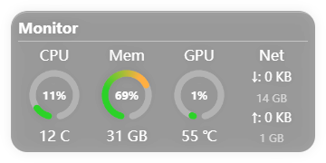
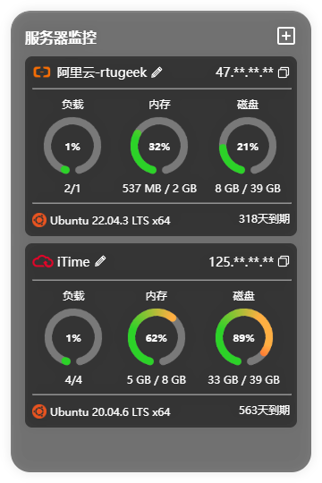

# Monitor
## A lightweight servers monitoring tool

**Monitor** is a lightweight server monitoring tool that allows you to view the status of multiple server on a single page.  
It provides real-time monitoring of key system metrics including **CPU, GPU, memory, disk, and network**.  
The server is built on **systeminformation** and offers **RESTful API** endpoints for easy customization and integration.

🔗 [Live Demo](https://rtugeek.github.io/monitor/#/)  
📘 [Usage Guide](https://widgetjs.cn/monitor/doc)

## Features

- 🚀 Built with Vue 3 + TypeScript
- 📦 CPU、GPU、Memory、Disk、Network monitoring
- ⚙️ RESTful API for easy integration
- 🖥️ Desktop widgets for quick access to server stats
- 🌐 Web interface for centralized monitoring

## Web Preview
### Homepage

### Add Server

## Desktop Widgets
### Base Panel Widget

### Server Widget

