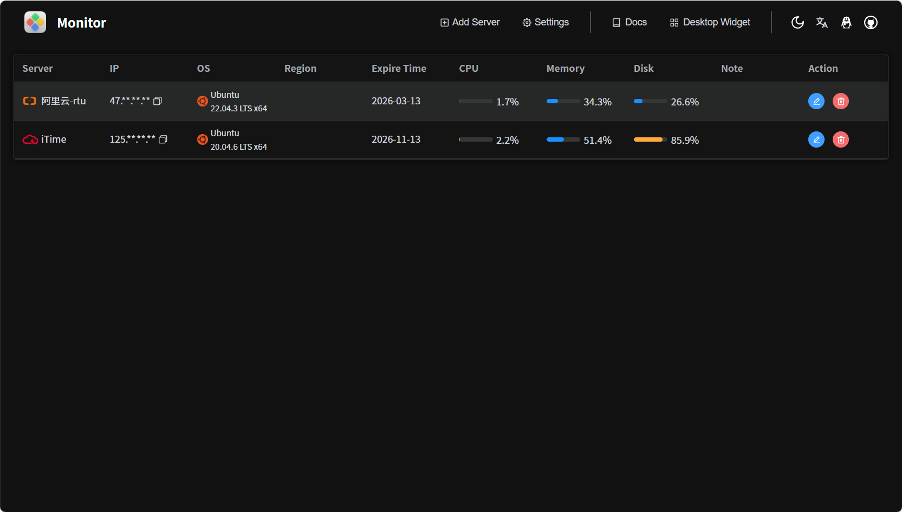

---
# VitePress 首页配置（基于 README 内容）
layout: home

hero:
  name: "Monitor"
  text: "轻量级服务器监控面板"
  tagline: "实时监控 CPU / GPU / 内存 / 磁盘 / 网络，提供 API 与桌面小部件"
  image:
    src: /foreground.png
    alt: Monitor
  actions:
    - theme: brand
      text: 在线演示
      link: https://rtugeek.github.io/monitor/#/
    - theme: alt
      text: 快速上手
      link: https://widgetjs.cn/monitor/doc/quick-start/

features:
  - title: 实时多维监控
    details: CPU、GPU、内存、磁盘、网络 等关键指标实时展示
  - title: RESTful API
    details: 基于 systeminformation 的 API，便于二次集成与自定义
  - title: 技术栈
    details: 使用 Vue 3 + TypeScript 构建，轻量可扩展

---

### 预览

