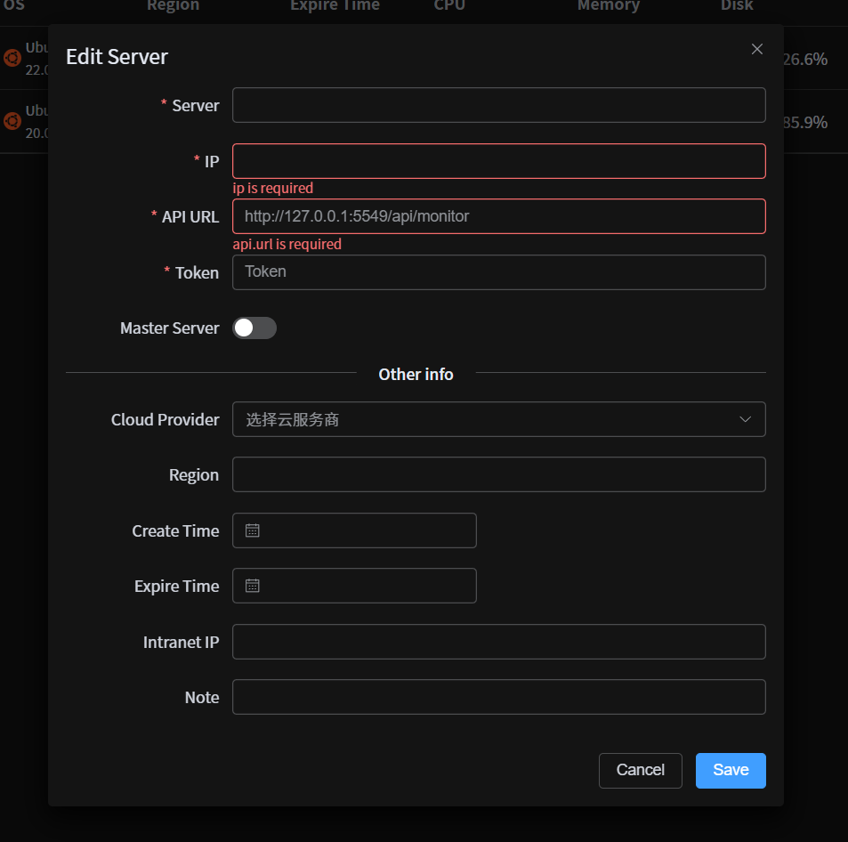

# 快速上手

## 服务器安装

使用 Docker 安装监控服务器
```shell
docker pull rtugeek/monitor-server
docker run -d -p 5549:5549 rtugeek/monitor-server
```

启动成功后会在控制台看到 `API Token` 和 `API Url` 信息：
```shell{3,5}
LOG [APP] Add the follow token to http request header or search params
LOG [APP] ↓↓↓↓↓↓↓↓↓↓↓↓↓↓↓↓↓↓↓↓↓↓↓↓↓↓↓↓↓↓↓↓
LOG [APP] sjq2eqcob0irqvs7rm21oxh8zh9zp1ya 👈 API Token
LOG [APP] ↑↑↑↑↑↑↑↑↑↑↑↑↑↑↑↑↑↑↑↑↑↑↑↑↑↑↑↑↑↑↑↑
LOG [APP] Public api baseUrl http://xx.xx.xx.xx:5549/api/monitor 👈 API Url
LOG [APP] Local api baseUrl http://127.0.0.1:5549/api/monitor
LOG [APP] Open http://xx.xx.xx.xx:5549/api/monitor/doc to see the api doc
```


## 前端添加服务器

打开[前端页面](https://rtugeek.github.io/monitor/#/)，点击`添加服务器`，将`API Url`和`API Token`填入对应位置，点击保存即可。




## Nginx 配置示例

```nginx configuration
location ~ ^/api/monitor/{
    proxy_pass http://localhost:5549; 
    proxy_connect_timeout 300s;
    proxy_send_timeout 900;
    proxy_read_timeout 900;
    proxy_buffer_size 32k;
    proxy_buffers 4 64k;
    proxy_busy_buffers_size 128k;
    proxy_redirect off;
    proxy_hide_header Vary;
    proxy_set_header Accept-Encoding '';
    proxy_set_header Referer $http_referer;
    proxy_set_header Cookie $http_cookie;
    proxy_set_header Host $host;
    proxy_set_header X-Real-IP $remote_addr;
    proxy_set_header X-Forwarded-For $proxy_add_x_forwarded_for;
}
```