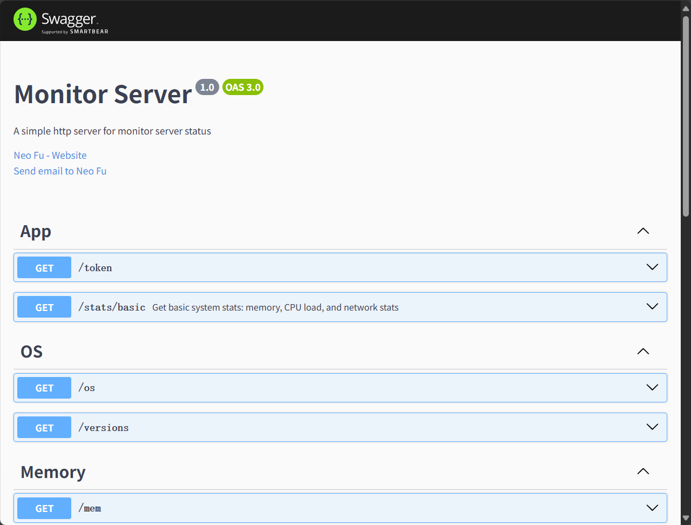

### 重要！

**Token** 必须包含在请求头或查询参数中；否则请求将无法通过身份验证。

Token 在服务器启动时生成，可在控制台日志中查看。

示例控制台输出：

```shell
...
[Nest] LOG [NestApplication] Nest application successfully started +1ms
[Nest] LOG [APP] Server port: 5549
[Nest] LOG [APP] Add the follow token to http request header or search params
[Nest] LOG [APP] ↓↓↓↓↓↓↓↓↓↓↓↓↓↓↓↓↓↓↓↓↓↓↓↓↓↓↓↓↓↓↓↓
[Nest] LOG [APP] sjq2eqcob0irqvs7rm21oxyour_token 👈 token is here
[Nest] LOG [APP] ↑↑↑↑↑↑↑↑↑↑↑↑↑↑↑↑↑↑↑↑↑↑↑↑↑↑↑↑↑↑↑↑
[Nest] LOG [APP] Open http://yourip:5549/api/monitor/doc to see the api doc
```

### 请求示例

获取系统基本信息
```http request
GET http://yourip:5549/api/monitor/os?token=sjq2eqcob0irqvs7rm21oxyour_token
```

重置 token

```http request
GET http://yourip:5549/api/monitor/token?newToken=your_new_token&token=old_token
```

### 浏览全部API 

全部API接口文档请访问：http://yourip:5549/api/monitor/doc

